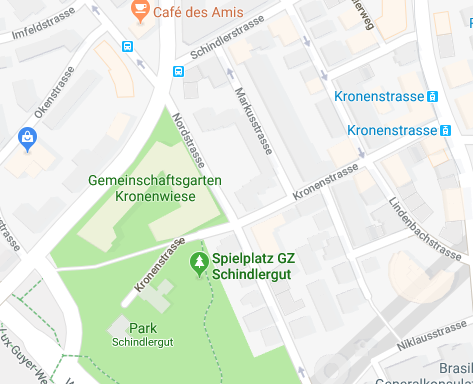

# Zürich 3D
Dies ist die Projektbeschreibung des Prototypen für das Zürich 3D Projekt.

## Motivation
Zur Visualisierung von Simulationen in 2D / 3D habe ich Tools gesucht und bin dabei auf die Game Engine [Unity3D](https://unity3d.com/unity), die [CityEngine](https://www.esri.ch/de/produkte/cityengine) von Esri und den [GIS-Browser](https://maps.zh.ch) der Stadt Zürich gestossen. 

<table style="width:100%">
  <tr>
    <td></td>
    <td></td> 
  </tr>
</table>

## Idee
Da Städte wie das heutige Zürich im Fokus der Simulation sind, bietet es sich an mit den 3D Daten der Stadt einen Prototypen zu bauen. Das Stadtmodell besteht aber nur aus den Quadern der Gebäude mit den Dächern. 

<table style="width:100%">
  <tr>
    <td></td> 
  </tr>
</table>

Also müsste ich eine Technologie wie [Computer Generated Architecture](https://cehelp.esri.com/help/index.jsp?topic=/com.procedural.cityengine.help/html/manual/cga/basics/toc.html) (CGA) der CityEngine verwenden oder selber entwickeln.

Aussen | Innenhof | Architektur  | Nacht 
------------ | ------------- | ------------- | -------------
 |  |  | 

*Sonst dürfte es schwierig werden, innert nützlicher Frist, und mit den mir zur verfügung stehenden finanziellen Mittel ans Ziel zu kommen.*

## Vision
Da Unity3D eine Game Engine ist, war folgende Projektidee naheliegend: **Simulations und Gamification Platform für Zürich in 3D**

Simulation | Gamification 
------------ | -------------
 | 

Manche mögen sich jetzt fragen: *was hat das **Soziale Netzwerk** da zu suchen ?* 

Die **MRS Mind Research Systems GmbH** hat den Zweck: **Erforschung von Gedanken und Gefühlen** 

Ein Soziales Netzwerk ist ein **Speicher für Emotionen**, den ich in 3D zu visualisieren versuche will.

* Ein **Like** ist doch kein differenzierter emotioneller Ausdruck ? 
* Auf was bezieht ein Like gepostet zu einem Bild überhaupt ?

Solche und andere Fragen zu beantworten, ist der Zweck der Simulation.

Mit **Zürich 3D** lassen sich aber auch interessante Spielanwendungen realisieren... 😃

## Vorgehen
Um solche Projekte abzuwickeln ist es nützlich sich an einschlägige Literatur zu halten. Denn schief gehen tut noch genug. 👻 
* Als Vorgehensmodell verwende ich [Scrum](https://www.scrumguides.org/docs/scrumguide/v1/scrum-guide-us.pdf). 
* Als Leitfaden für die Spielentwicklung halte ich mich an [Fundamentals of Game Design](http://ptgmedia.pearsoncmg.com/images/9780321929679/samplepages/0321929675.pdf). 
* Als Planungshilfe habe ich mir [How to Plan Game Environments and Level Designs](https://www.worldofleveldesign.com/store/preproductionblueprint.php) gekauft. 

Alles alleine umsetzen zu wollen ist **keine gute Idee**. Freelancer findet man auf Platformen wie [Upwork](https://www.upwork.com). *Sich etwas Expertenwissen zu organisieren, kann nicht schaden.* 😉

## Inspiration
Meine grösste Inspiration ist mein **Mami**, das Leben an und für sich und natürlich **Zürich**. Dann kommen noch all die lehrreichen und schönen **Bücher** die ich lesen durfte. Und natürlich die vielen **lieben Freunde**, die geduldig meinen verrücken Ideen lauschen und mir immer wieder verzeihen, wenn ich wieder einmal dem Fass den Boden ausschlage. 🙏
