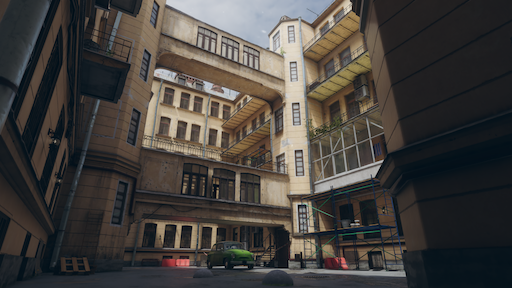
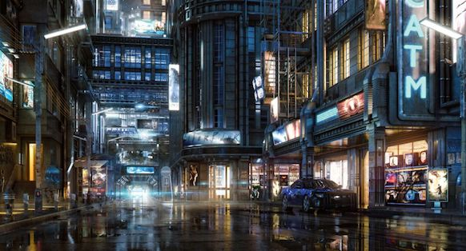

# Zürich 3D
Dies ist die Projektbeschreibung des Prototypen für das Zürich 3D Projekt.

## Motivation
Zur Visualisierung von Simulationen in 2D / 3D habe ich Tools gesucht und bin dabei auf die Game Engine [Unity3D](https://unity3d.com/unity), die [CityEngine](https://www.esri.ch/de/produkte/cityengine) von Esri und den [GIS-Browser](https://maps.zh.ch) der Stadt Zürich gestossen. 

<table style="width:100%">
  <tr>
    <td></td>
    <td></td> 
  </tr>
</table>

## Idee
Da Städte wie das heutige Zürich im Fokus der Simulation sind, bietet es sich an mit den 3D Daten der Stadt einen Prototypen zu bauen. Das Stadtmodell besteht aber nur aus den Quadern der Gebäude mit den Dächern. 

<table style="width:100%">
  <tr>
    <td></td> 
  </tr>
</table>

Also müsste ich eine Technologie wie [Computer Generated Architecture](https://cehelp.esri.com/help/index.jsp?topic=/com.procedural.cityengine.help/html/manual/cga/basics/toc.html) (CGA) der CityEngine verwenden oder selber entwickeln.

Aussen | Innenhof | Architektur  | Nacht 
------------ | ------------- | ------------- | -------------
 |  |  | 

*Sonst dürfte es schwierig werden, innert nützlicher Frist, und mit den mir zur verfügung stehenden finanziellen Mittel ans Ziel zu kommen.*

## Vision
Da Unity3D eine Game Engine ist, war folgende Projektidee naheliegend: **Simulations und Gamification Platform für Zürich in 3D**

Simulation | Gamification 
------------ | -------------
 | 

Manche mögen sich jetzt fragen: *was hat das **Soziale Netzwerk** da zu suchen ?* 

Die **MRS Mind Research Systems GmbH** hat den Zweck: **Erforschung von Gedanken und Gefühlen** 

Ein Soziales Netzwerk ist ein **Speicher für Emotionen**, den ich in 3D zu visualisieren versuche will.

* Ein **Like** ist doch kein differenzierter emotioneller Ausdruck ? 
* Auf was bezieht ein Like gepostet zu einem Bild überhaupt ?

Solche und andere Fragen zu beantworten, ist der Zweck der Simulation.

Mit **Zürich 3D** lassen sich aber auch interessante Spielanwendungen realisieren... 😃

## Vorgehen
Um solche Projekte abzuwickeln ist es gut sich an einschlägige Literatur zu halten. Denn schief gehen tut noch genug. 👻 
* Als Vorgehensmodell verwende ich [Scrum](https://www.scrumguides.org/docs/scrumguide/v1/scrum-guide-us.pdf). 
* Als Leitfaden für die Spielentwicklung halte ich mich an [Fundamentals of Game Design](http://ptgmedia.pearsoncmg.com/images/9780321929679/samplepages/0321929675.pdf). 
* Als Planungshilfe habe ich mir [How to Plan Game Environments and Level Designs](https://www.worldofleveldesign.com/store/preproductionblueprint.php) gekauft. 

Alles alleine umsetzen zu wollen ist **keine gute Idee**. Freelancer findet man auf Platformen wie [Upwork](https://www.upwork.com). *Sich etwas Expertenwissen zu organisieren, kann nicht schaden.* 😉

## Inspiration
Meine grösste Inspiration ist mein **Mami**, das Leben an und für sich und natürlich **Zürich**. Dann kommen noch all die lehrreichen und schönen **Bücher** die ich lesen durfte. Und natürlich die vielen **lieben Freunde**, die geduldig meinen verrücken Ideen lauschen und mir immer wieder verzeihen, wenn ich wieder einmal dem Fass den Boden ausschlage. 🙏

## Plan / Team
Der **Plan** mit einem **Team** aus mir und **3 Experten** in **vier Wochen den Prototypen für Zürich 3D** zu entwickeln.
 
* **Donat** ▫️ Lebenskünstler und Informatiker ▫️ **Zürich**, Schweiz
* **Leonard** ▫️ 3D Content Creator, Animator and Effects Artist ▫️ **Douala**, Cameroon
* **Phil** ▫️ GIS, CityEngine Expert / Developer ▫️ **Kisumu**, Kenya
* **Nirmla** ▫️ Expert with wordpress/PHP, HTML/CSS3, SASS, Angular JS ▫️ **Mandi**, India

## Projekt
Das Projekt für den Prototypen Zürich 3D startete am Montag den 22.10.2018 und sollet am Sonntag den 18.11.18 abgeschlossen sein. So viel der Plan 😎

### 💯 Sprint 1  
* Goal: Explore with data from TurboSquid and from GIS-Browser with Unity
* Period 22.10.2018 - 28.10.18
* Duration: 3 days
* Leonard time spent: 10.1 hrs
* 🥇 Success ratio: 100%   
* Summary: [Video Report](https://www.youtube.com/watch?v=gJH0NMV72y8&t=607s)

***

### 💯 Sprint 2  
* Goal: Explore with data from OpenStreetMap with Unity (80%) & construct first demo scenes (20%)
* Period 29.10.2018 - 04.11.18
* Duration: 7 days
* Leonard time spent: 40.0 hrs
* 👍 Success ratio: 80%   
* Summary: [Video Report](https://www.youtube.com/watch?v=zpmHGtxzrP4), construction of demo scenes not done as too many open questions regarding the data sources and how to construct facades in a efficient way.

***

### 💯 Sprint 3  
* Goal: Get the Stadtmodell Zürich 3D, Check [CityEngine](https://www.esri.com/en-us/arcgis/products/esri-cityengine/overview) capabilities and licence cost with [Esri](https://www.esri.ch), get in touch with local creatives such as illustrators, animation pros, film makers, find coworkers for 3D modelling, cartoon illustrators, 2D to 3D modellers, visit local 3D body scanner studio, create bookmarks for all the 3D, Unity animation stuff, buy and read books about animation styles, architecture, design.
* Period 05.11.2018 - 11.11.18
* Duration: 7 days
* Leonard Time spent: 7.4 hrs
* 🥇 Success ratio: 100%   
* Summary: [3D Stadtmodell OGD](https://data.stadt-zuerich.ch/dataset?q=3D+Stadtmodell+OGD)(1.5 GB tar file), CityEngine Advanced (Demo License 30days trial), [Christian Zogg](http://www.christianzogg.com) (Zürich), [Florian Baumann](http://www.florianbaumann.com/about/) (PULK Zürich), [Lilou Studio](http://www.liloustudio.com/3D_animation/index.php) (Margit Games Zürich), [Mookx](http://www.mookx.nl) (Amsterdam), Daniel Hovatis (Graz), [Gorille](http://gorille.co) (Paris), Bookmarks, [Wiki Animation 3D](https://github.com/mind-research-systems/zuerich/wiki/Animation-3D-Bookmarks)

***

### 💯 Sprint 4  
* Goal: Retro of last three weeks. Replanning until end of November 2018. Improve Documentation Quality (QMS). Do construct sample locations [Schindlerpark](https://www.google.ch/maps/place/Schindlergut/@47.3864388,8.5339195,17z/data=!3m1!4b1!4m5!3m4!1s0x47900a0d28ecddf5:0x9d56e4a79c4143ef!8m2!3d47.3864388!4d8.5361082), [Limmatplatz](https://www.google.ch/maps/place/Limmatpl.,+8005+Zürich/@47.3844261,8.5294995,17z/data=!3m1!4b1!4m5!3m4!1s0x47900a12589a41d7:0x2beaee1b7214c23e!8m2!3d47.3844225!4d8.5316935) or [Escher-Wyss-Platz](https://www.google.ch/maps/place/Escher-Wyss-Platz,+8005+Zürich/@47.3910482,8.5200328,17z/data=!3m1!4b1!4m5!3m4!1s0x47900a41c5a22331:0x5a85c425ae122858!8m2!3d47.3910446!4d8.5222268), [Kornhausbrücke](https://www.google.ch/maps/place/Kornhausbrücke,+Zürich/@47.3857063,8.5309521,17z/data=!3m1!4b1!4m5!3m4!1s0x47900a12a474e059:0x228d28bb36797350!8m2!3d47.3857027!4d8.5331461). 
* Duration: 5 days
* Time spent: 20.1 hrs
* Period 12.11.2018 - 18.11.18
* 🥇 Success ratio: 100%   
* Summary: **Diese Projektdokumentation**

