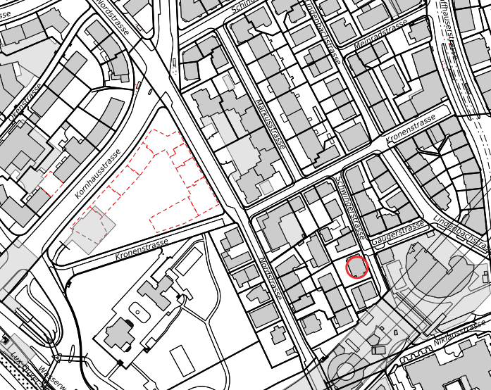

# Zürich 3D
Dies ist die Projektbeschreibung des Prototypen für das Zürich 3D Projekt.

## Motivation
Zur Visualisierung von Simulationen in 2D / 3D habe ich Tools gesucht und bin dabei auf die Game Engine [Unity3D](https://unity3d.com/unity), die [CityEngine](https://www.esri.ch/de/produkte/cityengine) von Esri und den [GIS-Browser](https://maps.zh.ch) der Stadt Zürich gestossen. 

<table style="width:100%">
  <tr>
    <td></td>
    <td></td> 
  </tr>
</table>

## Idee
Da Städte wie das heutige Zürich im Fokus der Simulation sind, bietet es sich an mit den 3D Daten der Stadt einen Prototypen zu bauen. Das Stadtmodell besteht aber nur aus den Quadern der Gebäude mit den Dächern. Also müsste ich eine Technologie wie Computer Generated Architecture (CGA) der CityEngine verwenden oder selber entwickeln. Denn nur so kommt man innert nützlicher Frist und mit den mir zur verfügung stehenden finanziellen Mittel ans Ziel. 

## Vision
Da Unity3D eine Game Engine ist, war folgende Projektidee naheliegend:

*Simulations und Gamification Platform für Zürich in 3D* 
